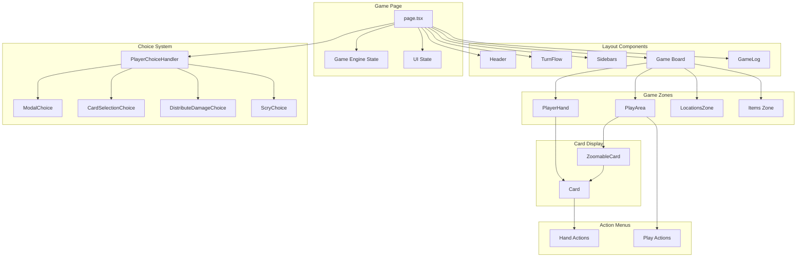

# UI Components

## Architecture Overview



---

## State Flow

### Game State
The game state flows from the engine through React state:

```
GameEngine.stateManager.state
    ↓
humanController.updateState()
    ↓
setEngineState(newState)
    ↓
Component re-render with new state
```

### Choice Handling
Player choices are handled asynchronously:

```
Engine requests choice → setCurrentChoice()
    ↓
PlayerChoiceHandler renders UI
    ↓
User makes selection
    ↓
handleChoiceResponse() → humanController.submitChoice()
    ↓
Engine continues execution
```

---

## Component Reference

### Card Display

| Component | Purpose | Key Props |
|-----------|---------|-----------|
| `Card.tsx` | Base card rendering | `card`, `isExerted`, `size`, `variant` |
| `ZoomableCard.tsx` | Hover zoom portal | `card`, `zoomScale`, `selected` |
| `CardActionMenu.tsx` | Hand card actions | `card`, `onInk`, `onPlay`, `onShift` |
| `PlayAreaActionMenu.tsx` | Play area actions | `card`, `onQuest`, `onChallenge` |

### Zone Components

| Component | Purpose | Key Props |
|-----------|---------|-----------|
| `PlayerHand.tsx` | Hand display | `cards`, `isOpponent`, `revealed` |
| `PlayArea.tsx` | Characters grid | `cards`, `onCardClick` |
| `LocationsZone.tsx` | Locations + chars | `locations`, `characters` |
| `GameZone.tsx` | Generic zone | `cards`, `label` |
| `InkPile.tsx` | Inkwell display | `cards`, `label` |
| `DiscardPile.tsx` | Discard summary | `cards`, `onClick` |

### Choice Components

| Component | Purpose |
|-----------|---------|
| `PlayerChoiceHandler.tsx` | Routes choices to correct UI |
| `ModalChoice.tsx` | Yes/No and multi-option prompts |
| `CardSelectionChoice.tsx` | Target selection interface |
| `DistributeDamageChoice.tsx` | Damage distribution UI |
| `ScryChoice.tsx` | Drag-and-drop reordering |

### Modals

| Component | Purpose |
|-----------|---------|
| `MulliganModal.tsx` | Opening hand mulligan |
| `DeckImportModal.tsx` | Deck import interface |
| `DiscardPileModal.tsx` | Full discard view |
| `RevealModal.tsx` | Card reveal display |
| `RevealHandModal.tsx` | Hand reveal display |
| `CardPickerModal.tsx` | Card selection from list |

### State & Info

| Component | Purpose |
|-----------|---------|
| `GameStatePanel.tsx` | Player stats (lore, deck) |
| `TurnFlow.tsx` | Turn/phase indicator |
| `GameLog.tsx` | Action log sidebar |
| `LogEntry.tsx` | Individual log item |
| `ActiveEffectsPanel.tsx` | Active effects display |
| `DebugPanel.tsx` | Debug tools (dev only) |

### Animations (`animations/`)

| Component | Purpose |
|-----------|---------|
| `AnimationDemo.tsx` | Animation showcase |
| `LoreGainEffect.tsx` | Lore gain animation |
| `StatChangeEffect.tsx` | Stat modification effect |
| `ChallengeEffect.tsx` | Challenge animation |
| `DrawAnimation.tsx` | Card draw animation |

---

## Animation System

Animations are triggered via state in `page.tsx`:

```typescript
// Lore animation
setLoreAnimation({
    show: true,
    amount: loreAmount,
    position: { x, y },
    key: prevKey + 1  // Force remount
});

// Stat change
setStatAnimation({
    show: true,
    amount: +2,
    statType: 'strength',
    position: { x, y }
});
```

Animations self-dismiss via `onComplete` callback.

---

## Adding New Components

1. Create `ComponentName.tsx` in `src/components/`
2. Add `'use client'` directive if using hooks
3. Define TypeScript interface for props
4. Export component as default
5. Add documentation to this README
6. Import in `page.tsx` if needed

---

## Image Utilities

See `src/utils/card-images.ts`:
- `getCardImagePath(card, variant)` - Get local image path
- `preloadCardImages(cards)` - Preload images
- `cardImageExists(card)` - Check existence

---

*Updated January 2026*
